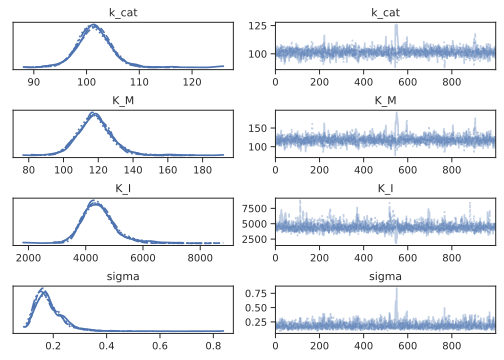
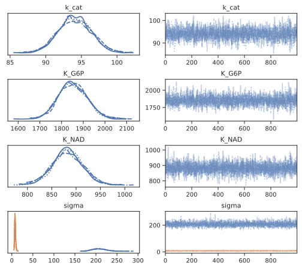
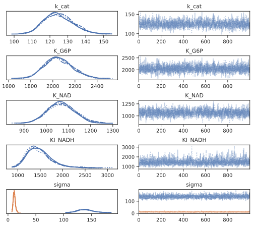
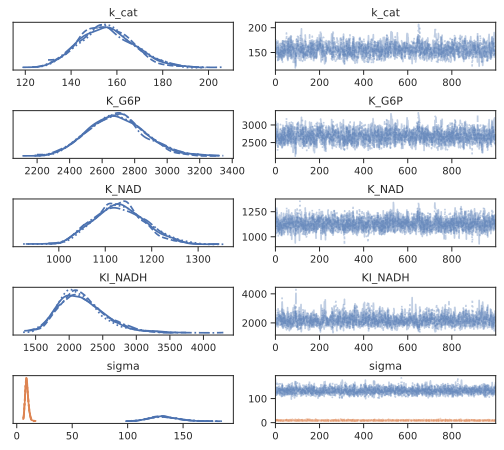
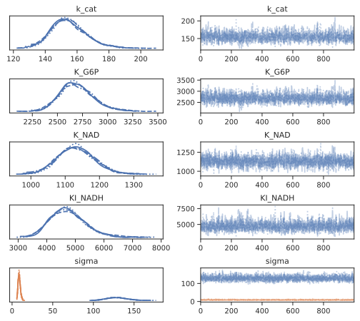

---
title:  'Supporting Information - A Bayesian approach to extracting kinetic information from enzymatic reaction networks'
institute:
  - imm: Institute for Molecules and Materials, Radboud University Nijmegen, Nijmegen, the Netherlands;
author:

- Mathieu G. Baltussen:
    institute:
        - imm
    correspondence: "no"
- Jeroen van de Wiel:
    institute:
        - imm
    correspondence: "no"
- Cristina Lía Fernández Regueiro:
    institute:
        - imm
    correspondence: "no"
- Miglė Jakštaitė:
    institute:
        - imm
    correspondence: "no"
- Wilhelm T.S. Huck:
    institute:
        - imm
    correspondence: "yes"
    email: w.huck@science.ru.nl

link-references: true

figureTitle: "Figure S"
tableTitle: "Table S"
figPrefix:
    - "Figure S"
    - "Figures S"
tblPrefix:
    - "Table S"
    - "Tables S"
citation-style: analytical-chemistry
link-citations: true
link-bibliography: true
geometry: margin=1in
header-includes:
  - \usepackage{pdfpages}
...

\tableofcontents

\newpage

# Materials and Instrumentation

## Materials

All chemicals and reagents were used as received from commercial suppliers without any further treatment unless stated otherwise.

### Enzymes

The enzymes immobilized on PEBs were purchased from Merck Sigma-Aldrich. Specifically:

- Lyophilized Trypsin (Tr) from bovine pancreas (product no. T1426)
- Lyophilized Glucose Dehydrogenase (GDH) from Pseudomonas sp. (product no. 19359)
- Lyophilized Hexokinase, type F-300 (HK) from Saccharomyces cerevisiae (product no. H4502)
- Lyophilized Glucose-6-phosphate dehydrogenase (G6P-DH) from Leuconostoc menesteroides (product no.
G8529)

Trypsin reactions was conducted in a 200 mM Tris buffer, pH 7.8, with 20 mM of CaCl2.
GDH, HK and G6P-DH reactions were conducted in a 200 mM Tris buffer, pH 7.8, with 10 mM of MgCl2.

### Substrates

The substrates Cbz-Arg-AMC (R-AMC, CAS: 3701-04-6, New catnr: 4002540.0050) and Suc-Ala-Ala-Ala-AMC (AAA-AMC, CAS 73617-90-0, New catnr: 4006305.0050) were purchased from BioConnect B.V. and were dissolved as 150 mM stock in anhydrous DMSO and kept frozen at -20°C. 

The substrates employed for all metabolic enzymatic reactions were: 

- Glucose (anhydrous) (Merck product no. 1083370250)
- glucose-6-phosphate hydrate (Sigma Aldrich product no. G7250)
- ATP disodium salt (Sigma Aldrich product no. A26209)
- ADP monosodium salt (Sigma Aldrich product no. A2754)
- NAD+ (Roche product no. 10127965001)
- NADH disodium salt (Roche product no. 10107735001)
- NADP+disodium salt  (Roche  product no. 10128031001)
- NADPH tetrasodium salt (Roche  product no. 1010724001)

## Instrumentation & Quantification protocols

### Flow setup
{#fig:reactor}

{#fig:flow_setup}

A custom made CSTR (see [@fig:reactor] for the design schematic, effective volume $100 \mu L$) was charged with PEBs (in a ratio of 1:31 mg beads:injection volume). 
The openings of the reactor were sealed with Whatman Nuclepore Track-Etch polycarbonate membranes (5 $\mu m$ poresize, cat. number 10417414) to prevent outflow of PEBs.
To subject the CSTR to various flow conditions we used Cetoni Low-Pressure High-Precision Syringe Pumps neMESYS 290N and gastight Hamilton syringes, with all flowrates programmed using the Cetoni neMESYS software.
For all methods of offline detection, the outflow of the CSTR was connected to a BioRad 2210 Fraction collector, collecting for 7.5 (absorbance) or 10 minutes (HPLC) per fraction.
This experimental setup is shown in [@fig:flow_setup]a-b

### Spectroscopy

#### Offline fluorescence
Collected fractions were pipetted onto a microplate (Greiner Bio One, black, polystyrene, 96 flat bottom chimney wells) at 60 $\mu L$ per well. 
Fluorescence measurements for enzyme activity determination were performed with a Tecan Spark 10M plate reader. 
The fluorescence intensity of wells containing 30-200 $\mu L$ of the reaction mixture was monitored for 1-4 min (shaking 3s/orbital mode/amplitude 4mm) at 23 °C using top or bottom reading mode, at $\lambda_{ex} / \lambda{_em} = 380\text{nm}/460\text{nm}$ for 7-amino-4-methylcoumarin (AMC) based  substrates. 

#### Offline absorbance

Collected fractions were pipetted onto a microplate (Greiner Bio One, transparent, polystyrene, 96 flat bottom chimney wells) at 60 $\mu L$ per well. 
The absorbance of each sample at 340 nm was measured in a TECAN SPARK M10 platereader.
Using a calibration curve, the absorbance data was converted to NADH concentration.

<!-- Absorbance measurements for enzyme activity determination were performed with a Tecan Spark 10M plate reader. 
The Absorbance intensity of wells containing 30-200 $\mu L$ of the reaction mixture was monitored for 1-4 min (shaking 3s/orbital mode/amplitude 4mm) at 23 °C using top or bottom reading mode.
$\lambda$ex/$\lambda$em =380 nm/460 nm for 7-amino-4-methylcoumarin-based substrates. -->

#### Online absorbance

Absorbance in flow experiments was continuously measured at the reactor’s output with a custom made flow cell kindly provided to us by LabM8 (shown in [@fig:flow_setup]c), connected to an AvaLight 355 nm LED lamp.
Absorbance at 380 nm was detected using an AvaSpec-2048 with 1,005 ms integration time and averaging at 200 times per recorded datapoint. 
Using a calibration curve, the absorbance data was converted to NADH concentration.

<!-- Absorbance in flow experiments was continuously measured at the reactor's output with a JASCO FP-8300ST spectrofluorometer for 7-amino-4-methylcoumarin-based substrates with thermostat at 25 °C, wavelengths excitation 380 nm, emission 460 nm, bandwidths excitation and emission each 5 nm, manual sensitivity – PMT voltage 300 V (500 V for multiplication experiments in S4.4) with use of handmade polystyrene flow cuvette with an inner tube diameter of 1 mm. -->

### High-performance liquid chromatography

<!-- #### Peptide quantification
High-performance Liquid Chromatography (HPLC) was performed using Shimadzu Nexera/Prominence system under a 0.8 mL/min flow at 50 °C with a Shim-pack GIST-AQ C18 column. 
For the Shimadzu system, an 8.8 min gradient program was used starting from 20% acetonitrile in H2O (both with 0.1% TFA): 
- 0.3 min – 20%
- 5.5 min – 90%
- 5.8 min – 90%
- 5.85 min – 20%
- 8.8 min – 20% -->

<!-- #### Nucleoside quantification -->
High-performance Liquid Chromatography (HPLC) was performed using Shimadzu NexeraX3/Prominence system under a 0.9 mL/min flow at 45 °C with a Shimadzu WAX-1 column. 
For the Shimadzu system, an injection volume was subjected to a 25 min gradient program was used starting from 20 mM of potassium phosphate at pH 7.0

- 1 min – 20 mM at pH 7.0
- 16 min – 480 mM at pH 6.8
- 19 min – 480 mM at pH 6.8
- 22 min – 20 mM at pH 7.0
- 25 min – 20mM at pH 7.0

Retention time of ADP is at 8.8 minutes, ATP at 15.5 minutes.

### G6P-DH assay
Collected fractions were pipetted onto a microplate (Greiner Bio One, transparent, polystyrene, 96 flat bottom chimney wells) at 60 $\mu L$ per well. 
To these wells was added an 20 $\mu L$ of 5 mM of NADP+ and 1 $\mu L$ of 500 u/mL of G6P-DH. 
The absorbance of each sample at 340 nm was continuously measured in a TECAN SPARK M10 platereader. 
Using a calibration curve, the absorbance data was converted to NADPH concentration. 
We assumed this NADPH concentration equivalent to G6P concentration.

\pagebreak
# Production and characterisation of polyacrylamide-enzyme beads

## Microfluidic devices fabrication for beads production
![Schematic of the microfluidic device for droplets production (*adaptated from [@Klein2015]*)](figures/si_beads_production.png){#fig:beads_production}

Microfluidic devices, designed according to the scheme shown in [@fig:beads_production] [@Klein2015], were produced in silicon wafers by photo and soft lithography, with different orifice sizes (20-80$\mu m$) at the T-junction, for droplet formation. 
After that, the wafers were used for the production of polydimethylsiloxane (PDMS) devices.
The PDMS replicas were separated from the wafer, and inlets and outlets of 1mm inner diameter were punched.
After the replica was bonded by oxygen plasma treatment to a glass slide, channels were coated with 2% 1H,1H,2H,2H-Perfluoro-octlytriethoxysilane to make them hydrophobic[@Matula2020].

## Method 1: Enzyme-first functionalization

This method was used for the synthesis of PEBs containing Trypsin.

### Synthesis 6-acrylaminohexanoic acid succinate (AAH-Suc) linker
N-6-acryloyl amido hexanoic acid (30 mg, 0.172 mmol, 1 eq) and N-Hydroxy succinimide (20mg, 0.172 mmol, 1eq) were added in a large glass vial and brought under N2 atmosphere. 
Subsequently, they were dissolved in 1 mL of anhydrous DMF and cooled down to 0°C. 
Then, N, N'-dicyclohexylcarbodiimide (DCC, 38mg, 0.172mmol, 1eq) was added, and the vial was sealed and left to stir at 0°C for one hour. 
Subsequently, the reaction was brought to 4°C and stirred for 16h. 
The reaction mixture was assumed quantitative and immediately used for enzyme functionalisation without further analysis[@Semenov2013].

### Enzyme functionalization
The desired enzyme (1 eq) was added to a falcon tube containing 0.1 M NaHCO3 (4mL), followed by addition of AAH-Suc (7.5 eq) in DMF. 
The mixture was left to stir at 21 °C for 1 h, after which the reaction mixture was dialysed and lyophilised. 

### General  Enzyme Immobilization During Polymerization (EIDP) method
An emulsion of monodisperse water-in-oil droplets was produced by using the microfluidic device described above with a 20 $\mu m$-wide T-junction, following an adapted procedure from Rivello et al.[3]
The reagents phase used for hydrogel formation was composed by 9.7% (w/v) acrylamide, 0.4% (w/v) bisacrylamide, 1.5% (w/v) 2,2'Azobis(2-methylpropionamidine) dihydrochloride (AAPH) and 0-8% (v/v) of a solution of functionalized enzyme (100 $\mu M$).
The oil phase was composed of fluorinated fluid HFE-7500 (3M) and 1.5% (v/v) Pico-Surf&trade; 1. 
The flow rates used to produce monodisperse beads of 50$\mu m$ average diameter were 600$\mu L/h$ (Qw) for the reagents phase and 900$\mu L/h$ for the oil phase (Qo).
The emulsion of droplets created in the microfluidic device was collected in an Eppendorf with 100 uL mineral oil to avoid evaporation and breaking the emulsion and polymerised for 10 minutes under UV light.
After polymerisation, beads were washed three times with 20% (v/v) 1H,1H,2H,2H perfluorooctanoic (PFO) in HFE-7500 oil to break the emulsion.
The obtained beads were then washed three times with 1% (v/v) Span 80 in heptane, three times with 0.1% (v/v) Triton X-100 in miliQ and three times with Milli-Q.
After every washing step, the beads were centrifugated 30 seconds at 5000 rcf, and the supernatant was removed by pipetting.
The resulting beads were freeze-dried and re-dissolved in miliQ at a concentration of 0.0322mg/$\mu L$.
Bead size was obtained after freeze-drying by imaging with a light microscope with a 40x objective lens.
The average bead size was 50 $\mu m$.

## Method 2: 

This method was used for the synthesis of PEBs containing GDH, HK, and G6PDH.

### Empty bead production method

The microfluidics device described above was used to produce gel beads with a 20 $\mu m$ wide T-junction, following an adapted procedure from [@Matula2020]. 
The gel solution phase consisted of 9.6% (w/v) acrylamide, 0.4% (w/v) N,N'-methylenebisacrylamide, 0.5% (w/v) acrylic acid and 1.5% (w/v) 2,2'Azobis(2-methylpropionamidine) dihydrochloride. 
The oil phase contained 1.5% (v/v) Pico-Surf&trade; 1 in fluorinated fluid HFE-7500 (3M). 
The flow rates for gel phase and oil phase were 600 $\mu L/h$ and 900 $\mu L/h$, respectively. 
The outflow emulsion was collected in the tube which was filled with 100 $\mu L$ mineral oil. 
Afterwards beads were polymerised using UV lamp for 10 minutes at 70% gain. 
After polymerisation the lowest layer containing fluorocarbon phase was carefully removed with a P200 pipette. 
The remaining beads were washed 3 times with 20% (v/v) 1H,1H,2H,2H-Perfluoro-1-octanol in HFE-7500 (3M), then 3 times with 1% (v/v) Span 80 in hexane, 3 times with 0.1% (v/v) Triton X-100 in Milli-Q and finally 3 times with Milli-Q. 
Every washing step was finalised with mixing the tube using vortex, centrifuging at 5000 x g for 3 min and removing the layer which was not containing beads. 
Furthermore, beads were flash frozen using nitrogen and freeze dried overnight. 
After re-wetting beads, their size was determined using light microscope with 40x magnitude objective. 
The average size was 50 $\mu m$ in diameter.

### General Enzyme Immobilisation after Polymerisation (EIAP) Method

Empty acrylamide beads were re-dissolved in Milli-Q at a concentration of 0.0322 mg/$\mu L$.
1-(3-Dimethylaminopropyl)-3-ethylcarbodiimide hydrochloride (100 mM) and N-Hydroxysuccinimide (100 mM) were added to the reaction mixture.
The total volume of the activation solution was 5-fold of the beads volume. 
The reaction mixture tube was put on the roller bank for 30 min. 
After this, beads were centrifuged at 5000 x g for 3 min. 
The supernatant was carefully removed using P200 pipette. 
Beads were washed 3 times by adding Milli-Q, mixing using vortex, centrifuging and removing the supernatant.
Specific to each batch of PEBs, a certain amount of enzyme was added to the beads (see [@tbl:PEBs]).
The tube was put on the roller bank for 2 h coupling step. 
Sequentially, beads were washed 8 times by adding Milli-Q, centrifuging and removing the supernatant. 
Finally, beads were flash frozen using nitrogen and freeze dried overnight.

## Overview of PEBs

|Enzyme|Batch number|Enzyme concentration added|Volume per mg of beads|
|:-----|:-----------|:-------------------------|:---------------------|
|GDH|1|0.54 kUnit/mL|100 $\mu L$/mg|
||2|2 kUnit/mL |100 $\mu L$/mg|
||3|1 kUnit/mL|100 $\mu L$/mg|
|HK|1|1 kUnit/mL |100 $\mu L$/mg|
|G6P-DH|1|1 kUnit/mL|100 $\mu L$/mg|

Table: Overview of PEB batches {#tbl:PEBs}


\pagebreak
# Overview of experiments

Processed datafiles from these experiments can be found on the accompanying [github repository](https://github.com/huckgroup/Bayesian-enzymatic-networks_manuscript_2022) in the `data` folder as csv-files.
The files are directly used during analysis performed in the Jupyter notebooks.

In the tables below, the volume refers to the volume of PEBs suspension injected into the CSTR, where the PEBs suspension itself is created by suspending 1 mg of dry PEBs in 31 $\mu L$ buffer, or other quantities in the same ratio (1:31). 
The batch refers to the batch of PEBs, which can contain different effective enzyme concentation. See [@tbl:PEBs] for an overview of all PEB batches.

| Code  |flowrate ($\mu L/h$)|enzyme|volume ($\mu L$)|batch|inputs|observables|observation techniques|
|:-------|:------|:------|:------|:-----|:---------|:--------|:---------------------|
|SNCA14|750|GDH|10|1|G, NAD|NADH|offline abs.|
|SNCA15|750|GDH|10|1|G, NAD|NADH|offline abs.|
|SNCA17|750|HK|10|1|G, ATP|G6P|G6P assay|
|SNCA18|750|HK|1|1|G, ATP|G6P|G6P assay|
|SNKS03|750|HK|1|1|G, ATP|G6P|G6P assay|
|SNKS04|750|HK|1|1|G, ATP|G6P,ATP|G6P assay, HPLC|
|SNKS08|750|G6PDH|10|1|G6P, NAD|NADH|offline abs.|
|SNKS11|750|GDH|0.5|2|G, NAD|NADH|online abs.|
|SNKS12|750|GDH|0.5|2|G, NAD|NADH|online abs.|
|SNKS18|750|GDH|2.0|3|G, NAD|NADH|offline abs.|
|SNKS20|750|G6PDH|2.0|1|G6P, NAD|NADH|online abs.|

Table: Overview of single-enzyme experiments

| Code  |flowrate ($\mu L/h$)|enzymes|volumes ($\mu L$)|batches|inputs|observables|observation techniques|
|:-------|:-----|:-------|:----------|:----|:------------|:-----------|:-----------------|
|SNKS06|750|GDH,HK|10.0, 1.0|1, 1|G, NAD, ATP|NADH, ADP|online abs., HPLC|
|SNNS002|750|GDH,HK|0.5, 1.0|2, 1|G, NAD, ATP|NADH|online abs.|
|SNNS003|750|GDH,HK|0.25, 1.5|2, 1|G, NAD, ATP|NADH|online abs.|
|SNNS004|750|GDH,HK|0.333, 1.33|2, 1|G, NAD, ATP|NADH|online abs.|
|SNNS005|750|GDH,HK|0.666, 0.666|2, 1|G, NAD, ATP|NADH|online abs.|
|SNNS006|750|GDH,HK|0.75, 0.5|2, 1|G, NAD, ATP|NADH|online abs.|
|SNNS007|750|GDH,HK|0.5, 1.0|2, 1|G, NAD, ATP|NADH|online abs.|

Table: Overview of multi-enzyme experiments

\pagebreak
# Overview of computational methods

Python scripts and Jupyter notebooks were used to create the Bayesian models and perform inference and predictive sampling. 
All computational studies were performed with Jupyter notebooks. Datasets were loaded in from csv-files with Pandas, and if relevant, concatenated together into larger objects.

The Bayesian model, including the determination of prior probabilities and likelihood function, was created using PyMC3[@Salvatier2016].
Generally, prior probabilities for Michaelis-Menten parameters were chosen as uniform distributions over a specified interval.
These distributions were used as uninformative priors to ensure no subjective information would enter the model, while garanteeing correct sampling and estimation of parameters.
Priors for the uncertainty estimations (denoted by `sigma` in the notebooks) were given an exponential distribution, which also acted as an uninformative distribution, while garanteeing correct sampling and convergence.
In larger models, where multiple likelihoods were combined, hyperpriors were placed on the $k_{cat}$ and $\sigma$ priors to increase convergence of the sampling algorithm.

All sampling was peformed using the No-U-Turn Sampler (NUTS)[@Hoffman2011], which is an adaptive step-size  Hamiltonian Monte Carlo sampler. 
When (automatically, or via a custom operator) the gradients of the likelihoods with respect to the kinetic parameters were given, this sampling method is much more efficient then a classical Metropolis Monte Carlo sampler, showing faster convergence and requiring less samples for precise posterior estimations.
Generally, sampling was performed using 4 or 8 independent chains on 4 or 8 cpu cores, all with 1000 tuning steps, and 1000 sampling steps, and a target step acceptance probability of 0.95.
These values were found to yield good sampling results without becoming computatially inefficient.

For likelihood calculations of partially observable ERNs, a custom steady-state likelihood operator was written in Theano, according to description given in the manuscript. 
This operator is freely available from the public github repository at [https://github.com/mgbaltussen/BayERN](https://github.com/mgbaltussen/BayERN).

The samples obtained from the posterior distribution were further analysed using standard statistical tools in Python, the Numeric Python package and the Scientific Python package (NumPy and Scipy)[@Virtanen2020].
To ensure the accessibility and reproducibility of these results the datasets and Jupyter notebooks, used for the analysis and creation of figures found in the publication, are made available as additional Supporting Information, and directly on github at [https://github.com/huckgroup/Bayesian-enzymatic-networks_manuscript_2022](https://github.com/huckgroup/Bayesian-enzymatic-networks_manuscript_2022).
This repository also includes version information for all software dependencies.

PDF reproductions of example notebooks with explanation (`example_simple.ipynb` and `example_complex.ipynb`) are also included in the appendix of this supporting information.

# Extended iterative combination of experiments

See [@fig:progression] for an extended version of the figure, showing posterior updating per iteration of new experiment.

![**Extended iterative posterior updating **  **A,B** Posterior parameter estimates obtained from the model combining all three (GDH, HK, GDH+HK) observation likelihoods. For every parameter, the distributions are shown for 15 different datasets, with each following dataset containing an extra experiment, added in chronological order. Distributions are shifted and scaled to increase visibility. For the GDH $k_{cat}$, two estimates are obtained because PEBs with two different enzyme concentrations were used in different experiments.](figures/fig_progression.svg){#fig:progression}

\pagebreak

# Model details & sampling diagnostics

## Obtaining improved accuracy from correlated parameter estimates
```notebooks/diagnostics/correlations_sampling.csv
Sampling statistics for manuscript Figure 1
```

Table: Sampling statistics for manuscript Figure 1

```notebooks/diagnostics/correlations.csv
Sampling diagnostics for manuscript Figure 1
```

Table: Sampling diagnostics for manuscript Figure 1

\pagebreak
{#fig:correlations_traces}

\pagebreak
## Combining diverse experimental datasets
<!-- \input{{notebooks/diagnostics/datafusion.tex}} -->

```notebooks/diagnostics/datafusion_sampling.csv
Sampling statistics for manuscript Figure 3
```

Table: Sampling statistics for manuscript Figure 3

```notebooks/diagnostics/datafusion.csv
Sampling diagnostics for manuscript Figure 3
```

Table: Sampling diagnostics for manuscript Figure 3

\pagebreak
{#fig:datafusion_traces_params}

\pagebreak

{#fig:datafusion_traces_sigmas}

\pagebreak
\pagebreak

## Comparing reaction mechanism hypotheses

### Hypothesis 0

```{.include}
notebooks/diagnostics/mechanisms_H_0_sampling.md
```
Table: Sampling statistics for manuscript Figure 5, Hypothesis 0

```{.include}
notebooks/diagnostics/mechanisms_H_0.md
```

Table: Sampling diagnostics for manuscript Figure 5, Hypothesis 0

### Hypothesis 1

```{.include}
notebooks/diagnostics/mechanisms_H_1_sampling.md
```
Table: Sampling statistics for manuscript Figure 5, Hypothesis 1

```{.include}
notebooks/diagnostics/mechanisms_H_1.md
```

Table: Sampling diagnostics for manuscript Figure 5, Hypothesis 1

### Hypothesis 2

```{.include}
notebooks/diagnostics/mechanisms_H_2_sampling.md
```
Table: Sampling statistics for manuscript Figure 5, Hypothesis 2

```{.include}
notebooks/diagnostics/mechanisms_H_2.md
```

Table: Sampling diagnostics for manuscript Figure 5, Hypothesis 2

### Hypothesis 3

```{.include}
notebooks/diagnostics/mechanisms_H_3_sampling.md
```
Table: Sampling statistics for manuscript Figure 5, Hypothesis 3

```{.include}
notebooks/diagnostics/mechanisms_H_3.md
```

Table: Sampling diagnostics for manuscript Figure 5, Hypothesis 3

### Hypothesis 4

```{.include}
notebooks/diagnostics/mechanisms_H_4_sampling.md
```
Table: Sampling statistics for manuscript Figure 5, Hypothesis 4

```{.include}
notebooks/diagnostics/mechanisms_H_4.md
```

Table: Sampling diagnostics for manuscript Figure 5, Hypothesis 4

\pagebreak
{#fig:mechanisms_H_0_traces}
{#fig:mechanisms_H_1_traces}
{#fig:mechanisms_H_2_traces}
{#fig:mechanisms_H_3_traces}
{#fig:mechanisms_H_4_traces}


# Appendix

<!-- \addcontentsline{toc}{section}{} -->
\includepdf[pages={-},addtotoc={1,subsection,2,Jupyter notebook: simple example,1}]{notebooks/pdfs/example_simple.pdf}
<!-- \addcontentsline{toc}{chapter}{Jupyter notebook: complex example} -->
\includepdf[pages={-},addtotoc={1,subsection,2,Jupyter notebook: complex example,1}]{notebooks/pdfs/example_complex.pdf}

# References